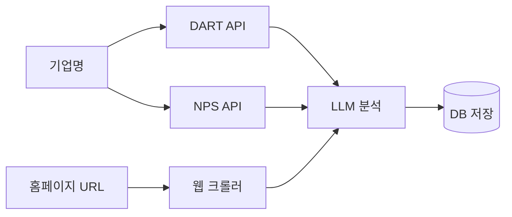
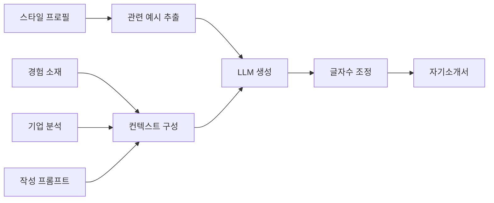
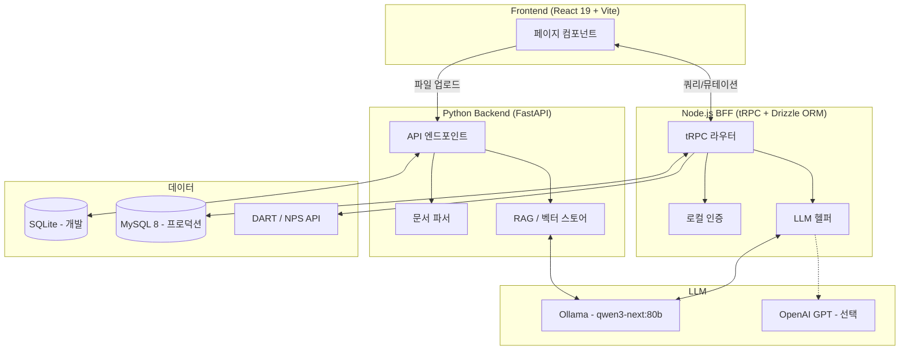
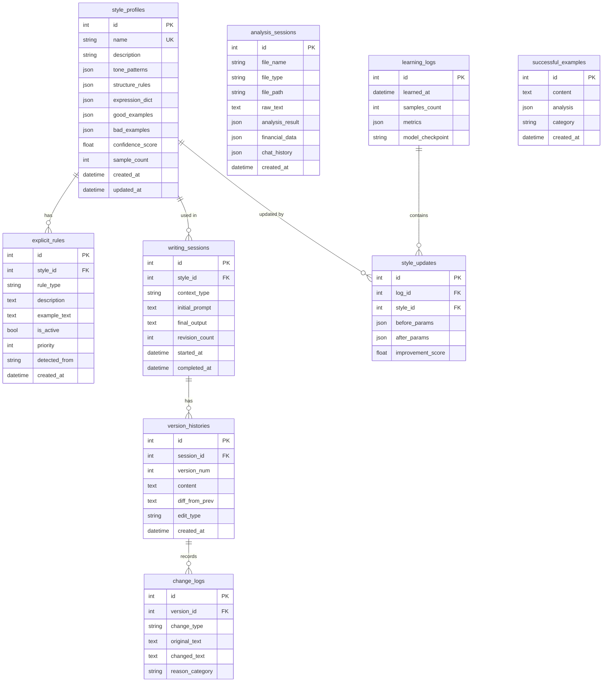
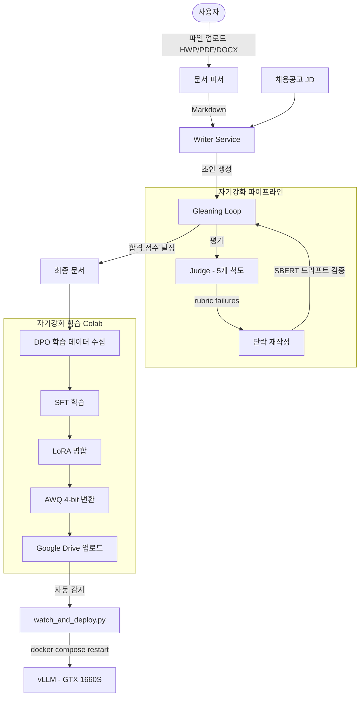
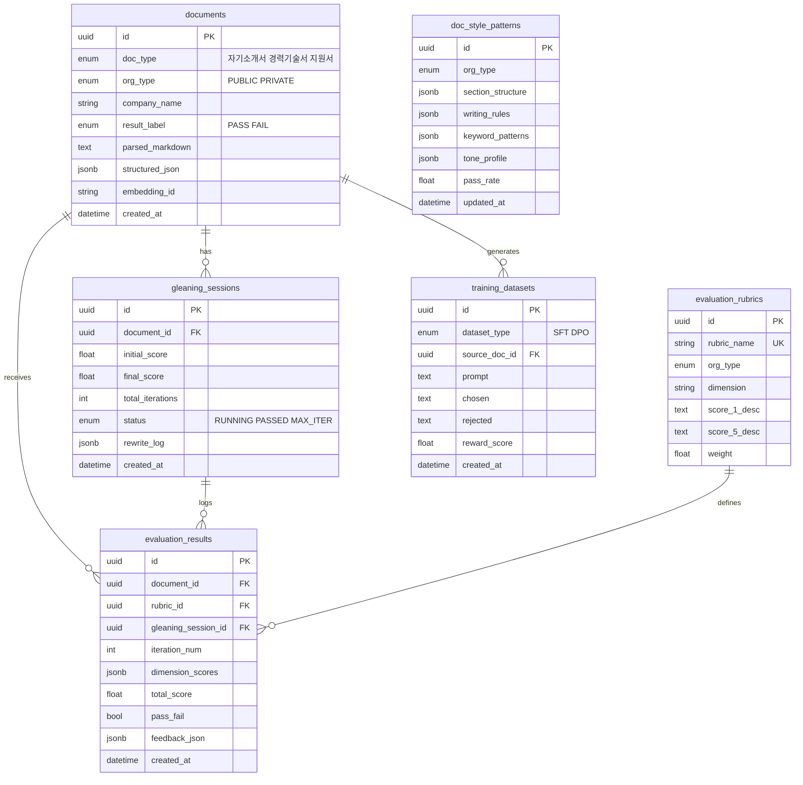

# ME — AI 취업 준비 모노레포

> **두 개의 독립 시스템으로 구성된 로컬 LLM 기반 취업 준비 통합 플랫폼**

[](https://python.org)
[](https://fastapi.tiangolo.com)
[](https://www.typescriptlang.org)
[](https://react.dev)
[](https://docker.com)

---

## 프로젝트 구성

| 서브 프로젝트 | 위치 | 설명 |
|---|---|---|
| **JasoS** | `app/` `front/` | AI 취업 준비 통합 플랫폼 (기업 분석 → 자소서 생성 → 면접 준비) |
| **DocMaster AI** | `docmaster/` | 로컬 LLM 기반 취업 문서 자동 평가·개선 시스템 (GTX 1660S + vLLM) |

---

## JasoS

취업 준비의 전 과정을 AI로 통합 지원합니다. 기업 공시 데이터 수집부터 맞춤형 자기소개서 생성, 면접 질문 생성까지 하나의 흐름으로 연결됩니다.

### 주요 기능

#### 1. 기업 분석
- **DART API**: 공시 정보 자동 조회 (법인명·대표자·설립일·업종)
- **NPS(국민연금) API**: 직원 수·월평균 급여·신규입사/퇴사 통계
- **AI SWOT 분석**: 수집된 데이터 기반 LLM 종합 분석



#### 2. 자기소개서 작성
- **스타일 학습**: 기존 합격 자소서를 학습하여 문체 프로파일 생성
- **경험 소재 구조화**: STAR 기법으로 경험 자동 분류 및 DB 저장
- **기업 맞춤형 생성**: 기업 분석 데이터 + 스타일 프로파일 + 경험 소재 → RAG 기반 자소서 생성
- **글자수 자동 조절**: 항목별 목표 글자수에 맞춰 자동 조정



#### 3. 면접 준비
- **예상 질문 생성**: 자소서 + 기업 분석 기반 맞춤 질문
- **모범 답변 전략**: 질문별 답변 프레임워크 및 핵심 포인트 제공
- **답변 스타일 학습**: 개인 답변 스타일 적용

#### 4. 경험 분석 (STAR)
- 텍스트 또는 파일(PDF·DOCX·HWP) 업로드 시 LLM이 STAR 구조로 자동 분류
- 리더십·창의성·분석력·공감능력 등 성향 점수 산출
- 분석 결과를 자소서 작성 시 RAG로 즉시 활용

### 아키텍처



### 데이터베이스 ERD



### 기술 스택

| 영역 | 기술 |
|---|---|
| **Frontend** | React 19, Vite, TailwindCSS, Shadcn/ui |
| **BFF (Node.js)** | tRPC v11, Drizzle ORM, MySQL2 |
| **Backend (Python)** | FastAPI 0.115, SQLAlchemy 2, Alembic |
| **LLM** | Ollama (`qwen3-next:80b`), OpenAI GPT (선택) |
| **문서 파싱** | Docling, PyHWP, python-docx, pypdf, pdfplumber |
| **DB** | SQLite (개발) / MySQL 8.0 (프로덕션) |
| **외부 API** | DART(전자공시), NPS(국민연금) |

### 설치 및 실행

**사전 요구사항**

- Python 3.11+
- Node.js 18+
- Ollama (`ollama run qwen3-next:80b`)
- MySQL 8.0+ (프로덕션) 또는 SQLite (개발 기본값)

**백엔드 (Python)**

```bash
python3 -m venv .venv
source .venv/bin/activate        # Windows: .venv\Scripts\activate
pip install -r requirements.txt
./start.sh                       # uvicorn :8000 시작
```

**프론트엔드 (Node.js)**

```bash
cd front
npm install
npm run dev                      # :5173 시작
```

**환경 변수** — 루트에 `.env` 생성:

```env
DATABASE_URL=sqlite:///./data/db/jasos.db

OLLAMA_BASE_URL=http://localhost:11434
OLLAMA_MODEL=qwen3-next:80b
OPENAI_API_KEY=                  # 선택

DART_API_KEY=your_dart_key
NPS_API_KEY=your_nps_key
```

**API 문서**: `http://localhost:8000/docs`

---

## DocMaster AI

GTX 1660S(6GB VRAM) 환경에서 로컬 LLM만으로 취업 문서를 자동 평가·개선합니다. 합격/불합격 패턴 학습을 통해 문서를 합격 수준으로 끌어올리는 자기강화 파이프라인을 구현합니다.

> 자세한 내용 → [`docmaster/`](./docmaster/)

### 핵심 개념

| 개념 | 설명 |
|---|---|
| **LLM-as-a-Judge** | 5개 척도(요구충족도·구조·표현력·구체성·차별화) 가중 평가 |
| **Gleaning Loop** | Judge 피드백 → 단락 재작성 → 재평가 (최대 5회 반복) |
| **BM25 + SBERT** | 하이브리드 갭 분석 + 할루시네이션 드리프트 감지 |
| **SFT + DPO** | 합격 문서 스타일 미세조정 (Google Colab Pro) |
| **자동 배포** | Colab 학습 완료 → Google Drive → 로컬 vLLM 자동 이식 |

### 전체 흐름



### 데이터베이스 ERD



### 환경 구성

| 컴포넌트 | 실행 환경 | 포트 |
|---|---|---|
| FastAPI 앱 서버 | Windows 네이티브 | 9000 |
| vLLM (Qwen3.5-4B AWQ) | Docker 컨테이너 | 8000 |
| PostgreSQL 16 | Windows 네이티브 | 5432 |
| Redis (Memurai) | Windows 네이티브 | 6379 |
| ChromaDB | Windows 네이티브 | 8100 |

### 지원 파일 형식

| 형식 | 파서 체인 |
|---|---|
| `.hwp` | hwp5txt CLI → pyhwp API → Docling |
| `.hwpx` | ZIP+XML 직접 파싱 → Docling |
| `.pdf` | Docling → pdfplumber → pypdf |
| `.docx` | Docling → python-docx (표·스타일 보존) |
| `.doc` / `.odt` / `.rtf` | Docling |
| `.txt` / `.md` | chardet 인코딩 감지 (EUC-KR/CP949/UTF-8) |

### 설치 (Windows 11)

```powershell
# 1. Google Drive OAuth2 인증 (최초 1회)
.\docmaster\scripts\deploy_local.ps1 -Auth

# 2. 환경 셋업 (Python 가상환경 + DB + Docker vLLM)
cd docmaster
.\setup_windows.ps1

# 3. FastAPI 서버 시작
uvicorn app.main:app --host 0.0.0.0 --port 9000 --reload

# 4. 자동 배포 데몬 시작 (Colab 학습 감지)
.\scripts\deploy_local.ps1
```

**환경 변수** — `docmaster/.env` 생성 (`.env.example` 참고):

```env
POSTGRES_HOST=localhost
POSTGRES_DB=docmaster_db
POSTGRES_USER=docmaster
POSTGRES_PASSWORD=your_pw

VLLM_BASE_URL=http://localhost:8000
MODEL_NAME=cyankiwi/Qwen3.5-4B-Instruct-AWQ-4bit

DART_API_KEY=your_dart_key
HF_TOKEN=your_huggingface_token
```

**API 문서**: `http://localhost:9000/docs`

### Colab 학습 → 자동 배포

```python
# Google Colab에서 실행
!pip install -q autoawq trl peft transformers datasets google-api-python-client
from google.colab import drive; drive.mount('/content/drive')

# SFT → DPO → LoRA 병합 → AWQ 변환 → Google Drive 업로드 → 배포 트리거
exec(open('/content/drive/MyDrive/docmaster/training/deploy_pipeline.py').read())
```

로컬에서 `deploy_local.ps1` 데몬이 실행 중이면 학습 완료 즉시 자동으로 vLLM에 이식됩니다.

---

## 레포지토리 구조

```
ME/
├── app/                        # JasoS — Python Backend (FastAPI)
│   ├── main.py
│   ├── core/                   # DB, Config
│   └── modules/                # analysis, learning, writing, interview, style
├── front/                      # JasoS — TypeScript Frontend + BFF
│   ├── client/src/pages/       # React 페이지
│   └── server/                 # tRPC 라우터, LLM 헬퍼
├── front-svelte/               # JasoS — Svelte 버전 (실험적)
├── RAG/                        # 재무 문서 RAG 챗봇 (독립 모듈)
├── docmaster/                  # DocMaster AI — 문서 평가·개선 시스템
│   ├── app/                    # FastAPI 앱
│   │   ├── models/             # DB 스키마 (6개 테이블)
│   │   ├── services/           # vLLM 클라이언트, 파서, Judge, Writer, Gleaning
│   │   ├── prompts/            # Writer / Judge / Gleaning 프롬프트 템플릿
│   │   └── api/v1/             # REST 엔드포인트
│   ├── alembic/                # DB 마이그레이션
│   ├── training/               # Colab 학습 + 자동 배포 파이프라인
│   ├── scripts/                # 데이터 관리, 자동 배포 데몬
│   ├── docker-compose.yml      # vLLM Docker 설정
│   └── setup_windows.ps1       # Windows 원클릭 셋업
├── requirements.txt            # JasoS Python 의존성
└── start.sh                    # JasoS 서버 시작 스크립트
```

---

## 라이선스

MIT License
