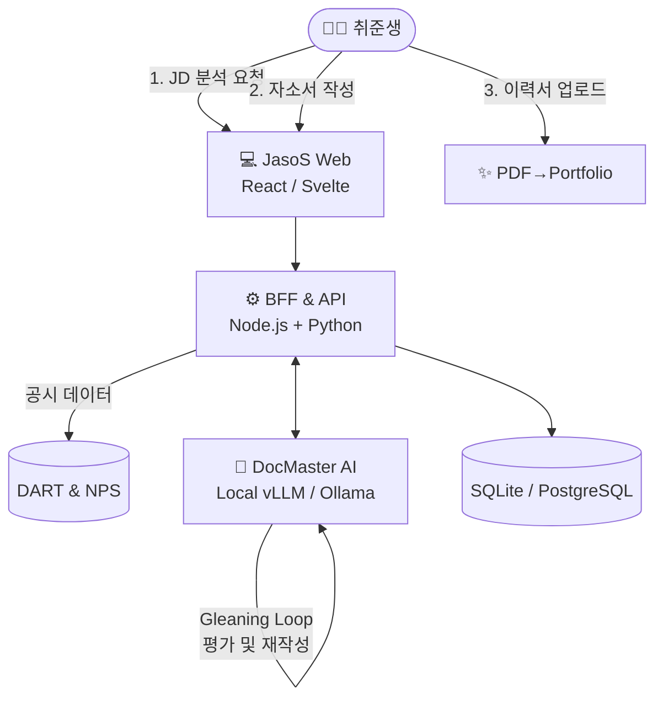

<div align="center">
  <h1>🚀 ME (Mono-repo for Employment)</h1>
  <p><strong>로컬 LLM과 데이터를 결합한 '자기 주도적 AI 취업 준비 플랫폼'</strong></p>
  
  [](https://python.org)
  [](https://react.dev)
  [](https://fastapi.tiangolo.com)
  [](https://sqlite.org)
  [](https://docker.com)
</div>

---

## ✨ 4대 핵심 키워드 (Core Values)

<table>
  <tr>
    <td align="center">
      <h3>📊 1. 데이터 기반 (Data-Driven)</h3>
      <p>DART(재무) & NPS(퇴사율) 공시 데이터 자동 수집</p>
    </td>
    <td align="center">
      <h3>🧠 2. 초개인화 AI (Hyper-Personalized)</h3>
      <p>과거 합격 자소서 문체를 학습하여 '내 말투'로 완벽 작성</p>
    </td>
  </tr>
  <tr>
    <td align="center">
      <h3>✨ 3. 제로-터치 포트폴리오</h3>
      <p>이력서 PDF만 넣으면 포트폴리오 웹사이트 즉시 자동 배포</p>
    </td>
    <td align="center">
      <h3>🎤 4. 모의 면접 (Mock Interview)</h3>
      <p>나의 경험과 채용공고를 매칭해 압박/직무/인성 꼬리질문 생성</p>
    </td>
  </tr>
</table>

---

## 🏛️ 아키텍처 한눈에 보기 (Architecture)


```mermaid
graph TD
    User([👨‍💻 취준생]) -->|1. JD 분석 요청| Web[💻 JasoS Web<br/>React / Svelte]
    User -->|2. 자소서 작성| Web
    User -->|3. 이력서 업로드| Port[✨ PDF→Portfolio]
    
    Web --> API[⚙️ BFF & API<br/>Node.js + Python]
    API -->|공시 데이터| DART[(DART & NPS)]
    
    API <--> AI[🧠 DocMaster AI<br/>Local vLLM / Ollama]
    AI -->|Gleaning Loop<br/>평가 및 재작성| AI
    
    API --> DB[(SQLite / PostgreSQL)]
```

---

## 🔥 주요 AI 파이프라인 (Core AI Technologies)

기존의 뻔한 취업 서비스들과 차별화되는 ME 프로젝트만의 2가지 핵심 인공지능 기술입니다.

* 📝 **DocMaster Gleaning Loop (자기강화 평가)**
  단순히 글을 써주는 것을 넘어, **LLM-as-a-Judge** 모델이 5가지 척도(구조, 구체성, 표현력 등)로 자소서를 스스로 평가합니다. 합격 기준 점수를 넘길 때까지 스스로 문단을 쪼개고 다듬는(Gleaning) 끈질긴 재작성 루프를 자랑합니다.
* 🕸️ **공시 데이터 RAG (팩트 기반)**
  환각(Hallucination)을 막기 위해 낡은 인터넷 검색 대신, 금융감독원(DART) 재무제표와 국민연금(NPS) 데이터를 직접 벡터화(ChromaDB)합니다. 이를 통해 매우 현실적이고 날카로운 면접 답변과 기업 분석을 도출해냅니다.

---

## 📁 프로젝트 구조 (Monorepo)

| 디렉토리 | 담당 역할 | 주요 기술 |
|---|---|---|
| 📂 **`front/`** | 사용자 통합 웹 인터페이스 (BFF 포함) | React 19, tRPC, Drizzle |
| 📂 **`app/`** | JasoS 메인 백엔드 & AI 에이전트 | FastAPI, Python |
| 📂 **`docmaster/`** | 자소서 5개 척도 평가 & 자기강화 개선 AI | PostgreSQL, vLLM, SFT |
| 📂 **`front-svelte/`** | 향후 SaaS 확장을 위한 Svelte 버전 | Svelte 5, MySQL |

---

## 🚀 빠른 시작 (Quick Start)

**1. 환경 변수 세팅**
```bash
# 루트 폴더에 .env 생성 (API 키 입력)
GEMINI_API_KEY=your_key
DART_API_KEY=your_key
NPS_API_KEY=your_key
```

**2. 프론트엔드 (React Web) 실행**
```bash
cd front
npm install
npm run dev  # http://localhost:5173
```

**3. 백엔드 (Python API) 실행**
```bash
python -m venv .venv
source .venv/bin/activate
pip install -r requirements.txt
./start.sh   # http://localhost:8000
```
