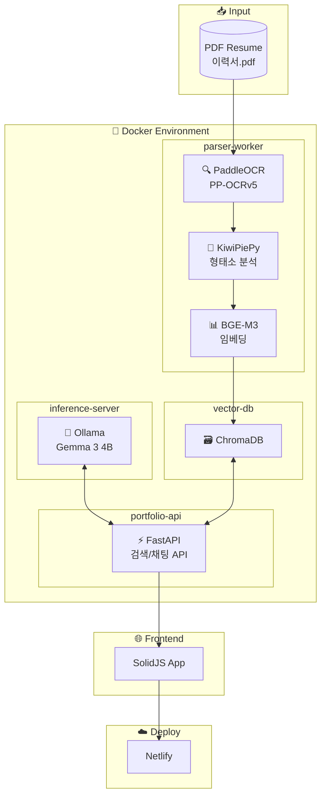
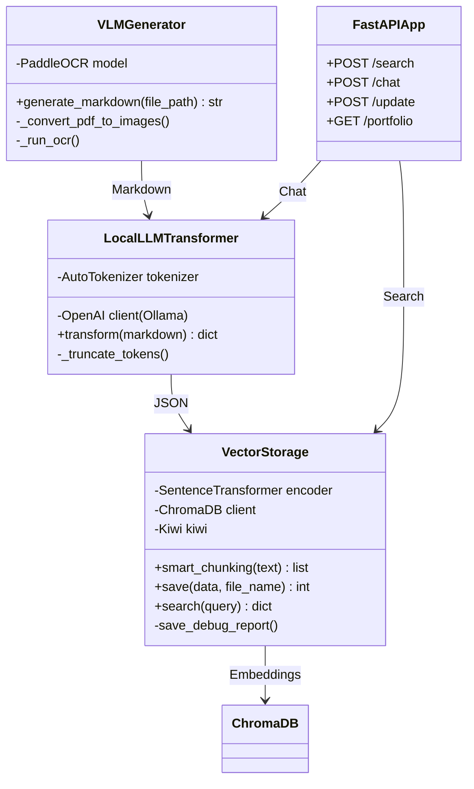
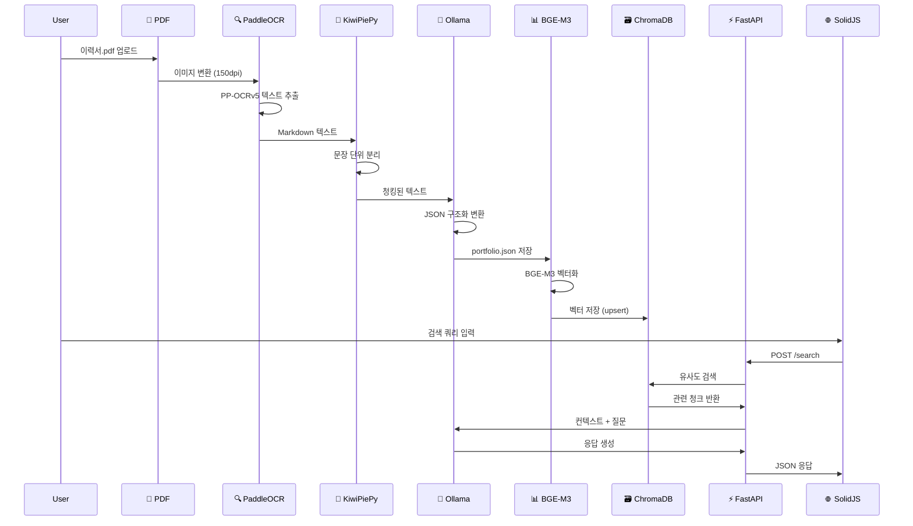

# 📄 PDF Resume to Portfolio Pipeline

**PDF 이력서를 자동으로 분석하여 SolidJS 포트폴리오 웹사이트로 변환하는 하이브리드 AI 파이프라인**

> 🎯 **핵심 가치**: 이력서 PDF 하나만 넣으면 완성도 높은 포트폴리오 웹사이트가 자동 생성됩니다.
>
> 설정이 완료됐으면
>
> docker exec -it esg_worker python backend/scripts/robust_pipeline.py 
>
> 그냥 이렇게 바로 치세요

---

## 📁 프로젝트 구조 (Project Structure)

```
pdf-type/
├── 📂 frontend/                # 🌐 프론트엔드 (React/Vite)
│   ├── src/
│   │   ├── App.tsx             # 메인 애플리케이션
│   │   ├── index.tsx           # 엔트리 포인트
│   │   ├── components/         # 공통 UI 컴포넌트
│   │   ├── features/           # 기능별 모듈
│   │   │   ├── intro/          # 자기소개 섹션
│   │   │   ├── projects/       # 프로젝트 섹션
│   │   │   ├── skills/         # 기술 스택 섹션
│   │   │   └── experience/     # 경력/학력 섹션
│   │   ├── styles/             # CSS 스타일시트
│   │   ├── types/              # TypeScript 타입 정의
│   │   └── utils/              # 유틸리티 함수
│   ├── public/                 # 정적 파일
│   ├── index.html              # HTML 템플릿
│   ├── package.json            # Node.js 의존성
│   ├── vite.config.ts          # Vite 설정
│   ├── tailwind.config.js      # Tailwind CSS 설정
│   └── tsconfig.json           # TypeScript 설정
│
├── 📂 backend/                 # 🐍 백엔드 (Python)
│   ├── api/
│   │   └── main.py             # FastAPI 서버 (검색/채팅 API)
│   ├── scripts/
│   │   ├── robust_pipeline.py  # 메인 OCR 파이프라인
│   │   ├── advanced_pipeline.py # 고급 파이프라인 (Router/Extractor)
│   │   ├── update_portfolio.py # 실행 진입점 + 이미지 추출
│   │   ├── extract_with_gemini.py # Gemini Vision 단독 테스트
│   │   └── parse_resume.py     # Docling 기반 파서
│   └── requirements.txt        # Python 의존성
│
├── 📂 docker/                  # 🐳 Docker 설정
│   ├── Dockerfile              # 컨테이너 이미지 정의
│   ├── docker-compose.yml      # 멀티 컨테이너 오케스트레이션
│   └── .dockerignore           # Docker 빌드 제외 파일
│
├── 📂 data/                    # 💾 통합 데이터 폴더
│   ├── personal/               # 📥 입력 PDF 파일
│   ├── chroma/                 # 🗃️ ChromaDB 벡터 저장소
│   ├── ollama/                 # 🧠 Ollama 모델 캐시
│   ├── models/                 # 🤗 HuggingFace 모델 캐시
│   ├── debug/                  # 🔍 디버그 리포트
│   └── portfolio.json          # ⭐ 파이프라인 출력 결과
│
├── .env                        # 환경변수 (API 키)
├── netlify.toml                # Netlify 배포 설정
└── README.md                   # 이 문서
```

---

## 🏛️ 시스템 아키텍처 (System Architecture)



---

## 🔗 컴포넌트 관계도 (Component Relationships)



---

## 🔄 파이프라인 플로우 (Pipeline Flow)



---

## 🛠️ 기술 스택 상세 (Technology Stack Details)

### 🌐 Frontend (SolidJS Web Application)

| 기술                   | 버전    | 역할                  | 적용 위치                      |
| ---------------------- | ------- | --------------------- | ------------------------------ |
| **SolidJS**      | ^1.8.0  | 반응형 UI 프레임워크  | `frontend/src/` 전체         |
| **TypeScript**   | ^5.3.3  | 정적 타입 검사        | `*.tsx`, `*.ts` 파일       |
| **Vite**         | ^5.0.10 | 빌드 도구 & 개발 서버 | `frontend/vite.config.ts`    |
| **Tailwind CSS** | ^3.4.0  | 유틸리티 CSS          | `frontend/src/styles/`       |
| **PostCSS**      | ^8.4.32 | CSS 후처리            | `frontend/postcss.config.js` |

**사용 예시:**

```tsx
// frontend/src/features/skills/SkillCard.tsx
import { Component, For } from 'solid-js';
import type { Skill } from '../../types/portfolio';

const SkillCard: Component<{ skill: Skill }> = (props) => (
  <div class="bg-gradient-to-r from-purple-500 to-pink-500 p-4 rounded-xl">
    <h3 class="text-xl font-bold">{props.skill.title}</h3>
    <For each={props.skill.items}>
      {(item) => <span class="badge">{item.name}</span>}
    </For>
  </div>
);
```

---

### 🐍 Backend (Python AI Pipeline)

| 기술                          | 버전     | 역할                           | 적용 위치                              |
| ----------------------------- | -------- | ------------------------------ | -------------------------------------- |
| **PaddleOCR**           | ^2.9.0   | PP-OCRv5 텍스트 추출           | `backend/scripts/robust_pipeline.py` |
| **KiwiPiePy**           | ^0.18.0  | 한국어 형태소 분석 & 문장 분리 | `VectorStorage.smart_chunking()`     |
| **SentenceTransformer** | ^2.2.0   | BGE-M3 임베딩 모델             | `VectorStorage.encoder`              |
| **ChromaDB**            | ^0.4.0   | 벡터 데이터베이스              | `VectorStorage.client`               |
| **FastAPI**             | ^0.109.0 | REST API 서버                  | `backend/api/main.py`                |
| **OpenAI SDK**          | ^1.0.0   | Ollama 호환 클라이언트         | `LocalLLMTransformer.client`         |
| **PyMuPDF**             | ^1.24.0  | PDF → 이미지 변환             | `VLMGenerator.generate_markdown()`   |

**사용 예시:**

```python
# backend/scripts/robust_pipeline.py
class VectorStorage:
    def smart_chunking(self, text, chunk_size=500, overlap_size=100):
        # 🥝 Kiwi로 문장 분리
        sents = [s.text for s in self.kiwi.split_into_sents(text)]
      
        # 오버랩 청킹 (문맥 유지)
        chunks = []
        current_chunk = []
        for sentence in sents:
            if len(' '.join(current_chunk)) + len(sentence) > chunk_size:
                chunks.append(' '.join(current_chunk))
                # 오버랩: 마지막 100자 유지
                current_chunk = current_chunk[-2:]
            current_chunk.append(sentence)
        return chunks
```

---

### 🐳 Docker (Containerization)

| 서비스                     | 이미지                     | 역할                      | 포트 |
| -------------------------- | -------------------------- | ------------------------- | ---- |
| **parser-worker**    | `pp_worker:pp_final_v1`  | OCR + 임베딩 + 파이프라인 | -    |
| **portfolio-api**    | `pp_worker:pp_final_v1`  | FastAPI 서버              | 8002 |
| **inference-server** | `ollama/ollama:latest`   | LLM 추론 (Gemma 3 4B)     | 8000 |
| **vector-db**        | `chromadb/chroma:latest` | 벡터 저장소               | 8001 |

**docker-compose.yml 구조:**

```yaml
services:
  parser-worker:
    build:
      context: ..
      dockerfile: docker/Dockerfile
    volumes:
      - ../data:/app/data
      - ../backend:/app/backend

  inference-server:
    image: ollama/ollama:latest
    volumes:
      - ../data/ollama:/root/.ollama
    ports:
      - "8000:11434"

  vector-db:
    image: chromadb/chroma:latest
    volumes:
      - ../data/chroma:/chroma/chroma
```

---

### ☁️ Deployment (Netlify)

| 설정                        | 값                | 설명                |
| --------------------------- | ----------------- | ------------------- |
| **Base Directory**    | `frontend`      | 빌드 기준 디렉토리  |
| **Build Command**     | `npm run build` | Vite 프로덕션 빌드  |
| **Publish Directory** | `dist`          | 정적 파일 배포 경로 |

---

## 🚀 Quick Start

### 1. 환경 설정

```bash
# Frontend 의존성
cd frontend
npm install

# Backend 의존성
cd ../backend
pip install -r requirements.txt
```

### 2. API 키 설정

`.env` 파일 생성 (프로젝트 루트):

```env
GEMINI_API_KEY=your_gemini_api_key
GROK_API_KEY=your_grok_api_key
HUGGING_FACE_HUB_TOKEN=your_hf_token
```

### 3. Docker 실행

```bash
cd docker
docker-compose up -d
```

### 4. 이력서 처리

```bash
# data/personal/ 폴더에 이력서 PDF 배치 후
docker-compose exec parser-worker python backend/scripts/robust_pipeline.py
```

### 5. 개발 서버

```bash
cd frontend
npm run dev
```

---

## 📊 데이터 흐름 요약 (Data Flow)

```
📄 PDF Resume
    │
    ▼
┌─────────────────────────────────────────────┐
│  1. PaddleOCR: 이미지 변환 → 텍스트 추출     │
│     (PP-OCRv5, Korean, 150dpi)              │
└─────────────────────────────────────────────┘
    │
    ▼
┌─────────────────────────────────────────────┐
│  2. KiwiPiePy: 한국어 문장 분리              │
│     + 오버랩 청킹 (500자, 100자 겹침)        │
└─────────────────────────────────────────────┘
    │
    ▼
┌─────────────────────────────────────────────┐
│  3. Ollama (Gemma 3 4B): JSON 구조화         │
│     Markdown → portfolio.json 변환          │
└─────────────────────────────────────────────┘
    │
    ▼
┌─────────────────────────────────────────────┐
│  4. BGE-M3: 벡터 임베딩                      │
│     청크 → 1024차원 벡터                     │
└─────────────────────────────────────────────┘
    │
    ▼
┌─────────────────────────────────────────────┐
│  5. ChromaDB: 벡터 저장 (upsert)             │
│     Cosine Similarity 기반 검색 가능         │
└─────────────────────────────────────────────┘
    │
    ▼
📊 portfolio.json + 🗃️ Vector Index
    │
    ▼
🌐 SolidJS Frontend → ☁️ Netlify Deploy
```

---

## 📝 Output Schema

```typescript
interface PortfolioData {
    profile: {
        name: string;
        title: string;
        bio: string;
        email: string;
        phone: string;
        website: string;
        image?: string;
    };
    projects: Array<{
        id: string;
        title: string;
        description: string;
        tags: Array<{ name: string }>;
        link: string;
        date?: string;
    }>;
    skills: Array<{
        title: string;
        items: Array<{
            name: string;
            level: "Expert" | "Advanced" | "Intermediate";
        }>;
    }>;
    awards: Array<{
        title: string;
        date: string;
        type: "Award" | "Certificate";
    }>;
}
```

---

## 📜 License

MIT License

---

## 🙏 Credits

- **PaddleOCR**: Baidu의 고성능 OCR 라이브러리
- **KiwiPiePy**: 한국어 형태소 분석기
- **Ollama**: 로컬 LLM 실행 플랫폼
- **ChromaDB**: AI-native 벡터 데이터베이스
- **SolidJS**: 고성능 리액티브 프레임워크
- **Netlify**: JAMstack 배포 플랫폼
