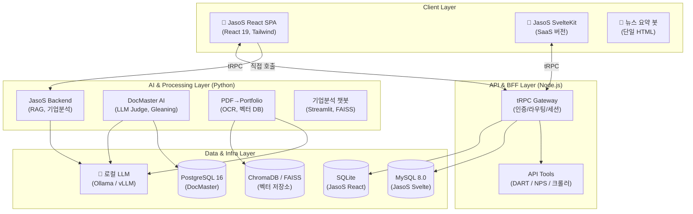
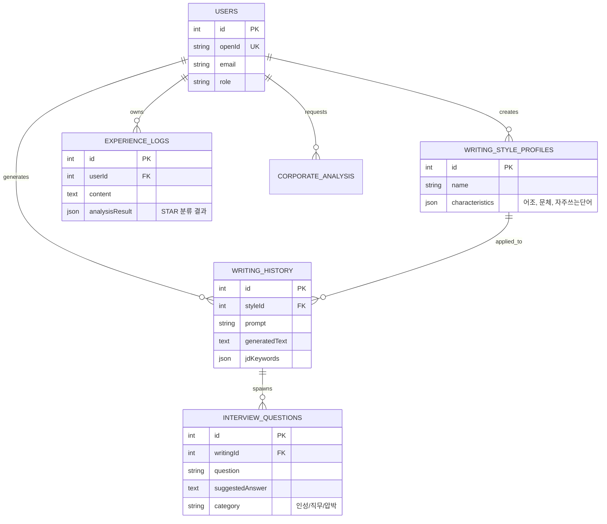

# ME (Mono-repo for Employment) 통합 시스템 설계서

> **버전**: 1.0 (2026-07-19 최종 검증 반영)
> **목적**: ME 모노레포 내 6개 서브 프로젝트의 비전, 아키텍처, 유저 플로우 및 데이터 모델 통합 가이드

---

## 1. 🎯 프로젝트 비전 및 목표

**"한국 취업 시장에 특화된, 데이터 중심의 자기 주도적 AI 취업 준비 플랫폼"**

기존 취업 컨설팅의 높은 비용과 파편화된 도구(기업 분석 따로, 이력서 따로, 면접 준비 따로)의 한계를 극복하기 위해, **JD(채용공고) 분석부터 포트폴리오 생성까지 하나의 워크플로우로 통합**하는 것을 목표로 합니다.

**핵심 가치 제안 (Value Proposition):**
1. **데이터 기반 객관성**: DART(전자공시), NPS(국민연금) 기반의 실제 기업 지표 활용
2. **초개인화된 AI**: 사용자 본인의 기존 '합격 자소서' 문체와 톤을 학습(Style Learning)하여 반영
3. **자기강화형 개선 (Gleaning)**: 로컬 LLM(DocMaster)을 통한 5개 척도 다중 평가 및 자동 재작성
4. **Seamless 파이프라인**: 텍스트 이력서를 넣으면 포트폴리오 웹사이트가 나오는 자동화(PDF→Portfolio)

---

## 2. 🏛️ 통합 시스템 아키텍처 (High-Level)

전체 시스템은 **사용자 접근성(JasoS Web)**과 **고성능 데이터 처리(DocMaster/Main)**로 분리된 마이크로서비스 지향 모노레포 구조입니다.



---

## 3. 🔄 핵심 워크플로우 (User Scenarios)

### Scenario A: 채용 공고(JD) 분석 및 맞춤형 자소서 생성
1. **[분석]** 사용자가 관심 있는 JD 텍스트/파일을 업로드 (`/analysis`)
2. **[수집]** 시스템이 JD에서 기업명을 추출 → DART(재무/매출) 및 NPS(퇴사율/급여) 데이터 자동 수집
3. **[평가]** 시스템이 JD 요구사항과 사용자의 경험 데이터(`experience_logs`)를 매칭하여 적합도 점수 산출
4. **[작성]** 사용자가 학습시킨 본인의 문체 프로파일(Style Profile)을 적용하여 자소서 초안 생성 (`/writing`)
5. **[개선]** 생성된 초안을 DocMaster AI로 전송하여 5개 척도 평가 후 Gleaning(반복 개선) 수행

### Scenario B: 모의 면접 준비
1. **[추출]** 완성된 자소서와 JD를 기반으로, AI가 공격형/방어형/검증형 질문 10개 자동 생성 (`/interview`)
2. **[가이드]** 각 질문에 대해 STAR 기법 기반의 '답변 전략(Answer Strategy)' 제시
3. **[연습]** 사용자의 면접 스타일 프로파일을 반영한 모범 답변 예시 제공

### Scenario C: 제로-터치 포트폴리오 생성
1. **[입력]** 사용자가 기존 PDF 이력서를 `PDF→Portfolio` 파이프라인에 업로드
2. **[추출]** PaddleOCR + Docling으로 텍스트 및 레이아웃 구조 추출
3. **[구조화]** LLM이 프로젝트, 기술스택, 경험을 JSON 데이터로 완벽히 구조화
4. **[배포]** 사전 구성된 SolidJS 템플릿에 데이터가 주입되어 Netlify 등 정적 호스팅으로 즉시 배포됨

---

## 4. 📱 UI/UX 화면 흐름도 (JasoS Web)

**wouter** 라우팅 기반의 Single Page Application 흐름입니다.

```mermaid
stateDiagram-v2
    [*] --> Home: 접속 (/)
    
    Home --> Login: 미인증 시 (/login)
    Login --> Home: 인증 완료
    
    state "메인 내비게이션" as Nav {
        Corporate: 기업 분석 (/corporate)
        JD: 채용공고 분석 (/analysis)
        Style: 문체 학습 (/learning)
        Writing: 자소서 작성 (/writing)
        Interview: 면접 준비 (/interview)
        History: 보관함 (/history)
        MyPage: 마이페이지 (/my)
    }
    
    Home --> Nav
    
    JD --> Corporate: 기업명 자동 추출 시 전환
    Corporate --> Writing: 분석 결과 기반 작성 시작
    Style --> Writing: 학습된 스타일 적용
    Writing --> Interview: 작성된 자소서 기반 질문 생성
    Writing --> History: 저장
```

---

## 5. 🗄️ 데이터 모델 (ERD)

핵심 도메인은 사용자(User), 경험(Experience), 스타일 프로파일(StyleProfile), 생성 결과(Writing/Interview)로 나뉩니다.

### JasoS 통합 DB (SQLite / MySQL)



### DocMaster 평가 DB (PostgreSQL)
- **Document**: 분석 대상 문서 (doc_type, org_type)
- **EvaluationRubric**: 5개 평가 척도 (요구충족도, 구조, 표현력, 구체성, 차별화)
- **EvaluationResult**: 척도별 점수 및 피드백 (dimension_scores, pass_fail)
- **GleaningSession**: 반복 개선 로그 (initial_score, final_score, total_iterations)

---

## 6. 🚀 배포 전략 및 인프라 (Deployment)

시스템은 **하이브리드 로컬-클라우드** 아키텍처를 채택합니다. LLM 추론과 민감한 데이터는 로컬에서, 웹 접근은 가벼운 클라우드에서 처리합니다.

| 티어 (Tier) | 컴포넌트 | 배포 대상 | 기술 스택 |
|------------|---------|----------|----------|
| **Frontend** | JasoS React/Svelte | Netlify / Vercel | 정적 사이트 호스팅 (CDN) |
| **BFF API** | tRPC Server | Cloudflare Workers / Vercel | Serverless Functions |
| **Database** | JasoS DB | Turso (SQLite) / PlanetScale | Serverless DB |
| **AI Backend** | Python FastAPI | **로컬 워크스테이션** | Docker, uvicorn |
| **LLM Inference** | Ollama / vLLM | **로컬 워크스테이션 (GPU)** | Docker (NVIDIA Runtime) |
| **Vector DB** | ChromaDB | 로컬 워크스테이션 | Docker |

**자동화 (CI/CD):**
- DocMaster는 Colab에서 모델 파인튜닝(SFT/DPO) 완료 시 Google Drive를 통해 가중치를 동기화하고, 로컬의 `watch_and_deploy.py`가 감지하여 vLLM 컨테이너를 자동 재시작하는 CD 파이프라인이 구축되어 있습니다.

---

## 7. 🗺️ 향후 개발 로드맵 (Milestones)

- **Phase 1: 기반 통합 (완료)**
  - 개별 서브 프로젝트(React, Svelte, DocMaster, 포트폴리오) 기능 검증 및 로컬 구동
- **Phase 2: RAG 파이프라인 고도화 (현재)**
  - DART/NPS API와 연동된 기업 데이터 벡터화 및 하이브리드 검색 도입
- **Phase 3: 자기강화 학습 모델 적용 (진행 중)**
  - DocMaster의 Gleaning Loop 결과를 DPO(Direct Preference Optimization) 데이터셋으로 구축하여 로컬 vLLM 자체 미세조정
- **Phase 4: SaaS 클라우드 마이그레이션 (예정)**
  - front-svelte 버전을 기반으로 멀티테넌트 지원, 구독형 과금 모델 도입

---
---

## 📎 부록: 서브 프로젝트 기술 참조 (Technical Reference)

<details>
<summary>1. JasoS (React) 상세 사양</summary>

- **환경**: Node.js 18+, Python 3.11+, SQLite
- **프론트엔드**: React 19.2, Vite 7.1, wouter 3.3, TailwindCSS
- **라우트 (12개 활성)**: `/`, `/corporate`, `/analysis`, `/writing`, `/learning`, `/interview`, `/my`, `/sentiment`, `/history`, `/login`, `/blog`, `/blog/:slug`
- **BFF (tRPC)**: 9개 네임스페이스 (auth, user, writingLearning, interviewLearning, writing, interview, experience, corporate, content), 40개 이상 프로시저
- **Python API (FastAPI)**: 29개 엔드포인트
- **주요 통합**:
  - DART API (`OpenDartReader` 및 `server/tools/dart.ts`)
  - NPS API (`xmltodict` 공공데이터 및 `server/tools/nps.ts`)
</details>

<details>
<summary>2. JasoS (SvelteKit) 상세 사양</summary>

- **환경**: Node.js 18+, MySQL 8.0
- **스택**: Svelte 5, SvelteKit 2, tRPC v10, Drizzle ORM, TailwindCSS 4
- **인증**: bcryptjs + JWT (`jasos_user_id` 쿠키)
- **차이점**: React 버전과 기능은 유사하나, 완전한 풀스택 구조로 MySQL 데이터베이스를 직접 바라봄. (SaaS 확장에 용이)
</details>

<details>
<summary>3. DocMaster AI 상세 사양</summary>

- **환경**: NVIDIA GPU (GTX 1660S 이상), Docker, PostgreSQL
- **역할**: LLM-as-a-Judge 및 자동 재작성 (Gleaning Loop)
- **서비스 (8개)**: `vllm_client.py`, `parser_service.py`, `writer_service.py`, `judge_service.py`, `gleaning_service.py`, `cover_letter_service.py`, `matcher_service.py`, `analyzer_service.py`
- **파서 지원**: `.hwp`, `.hwpx`, `.pdf`, `.docx`, `.doc`, `.txt`
- **LLM**: `cyankiwi/Qwen3.5-4B-Instruct-AWQ-4bit` (vLLM 도커 배포)
</details>

<details>
<summary>4. PDF→Portfolio 상세 사양</summary>

- **환경**: Docker Compose (4개 컨테이너)
- **파이프라인**: PaddleOCR → KiwiPiePy → Gemma 3 4B → BGE-M3 임베딩 → ChromaDB
- **결과물**: JSON 구조화 데이터 → SolidJS 정적 웹사이트 자동 빌드 (Netlify 연동)
</details>

<details>
<summary>5. RAG 기업 분석 챗봇 상세 사양</summary>

- **환경**: Python 3.11, Streamlit
- **데이터소스**: DART (JSON/CSV), PDF 기업 리포트, 뉴스 검색
- **AI/LLM**: OpenAI GPT (챗봇), Google Gemini 1.5 Pro (기업정보/뉴스 분석), FAISS 벡터 검색
- **화면 구성**: 경제 현황, 기업 동향, 챗봇, 채용 달력, 기업 검색
- ⚠️ *알려진 이슈*: `st.py`에 `interview_supporter` 모듈 import 에러 존재
</details>

<details>
<summary>6. 보안 및 환경설정 경고</summary>

- 🔴 `.env.example`에 실제 Google API 키 노출 (`AIzaSy...`) → 즉시 삭제 및 무효화 필요
- 🟡 `DART_API_KEY`, `NPS_API_KEY` 환경변수 세팅 필요
- 🟡 `OLLAMA_MODEL` 변수에 `ollama run` 명령어 제외하고 모델명(`qwen3-next:80b`)만 기재할 것
</details>
